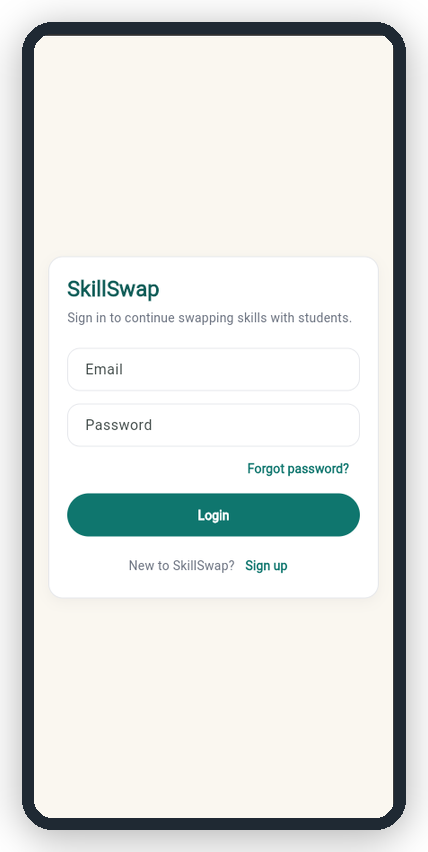
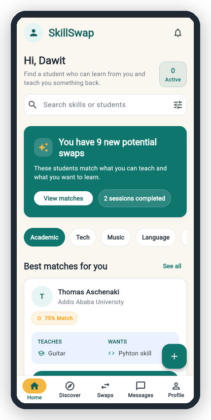
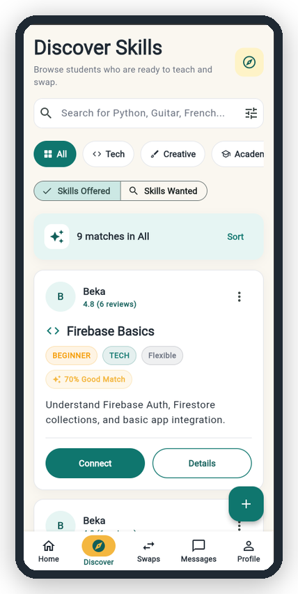
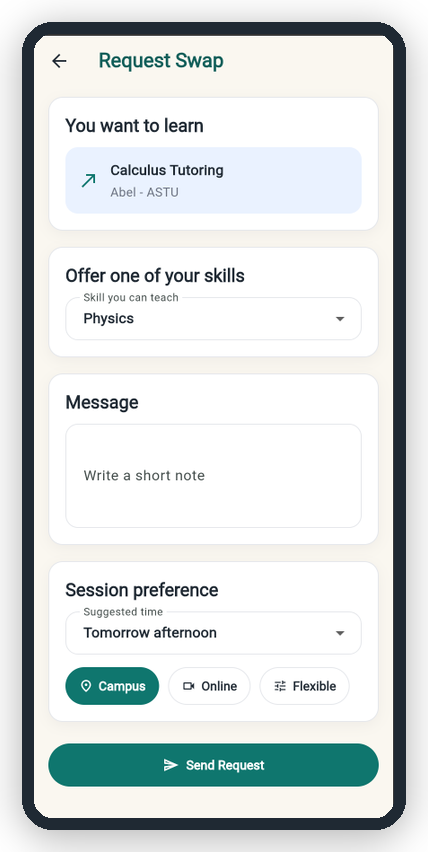
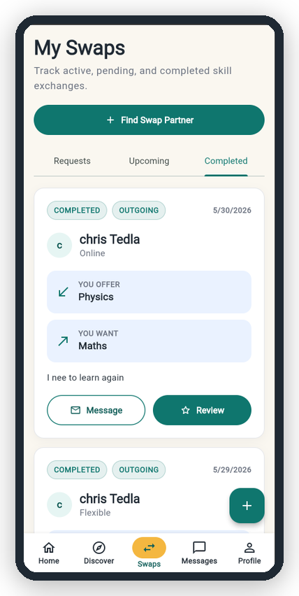
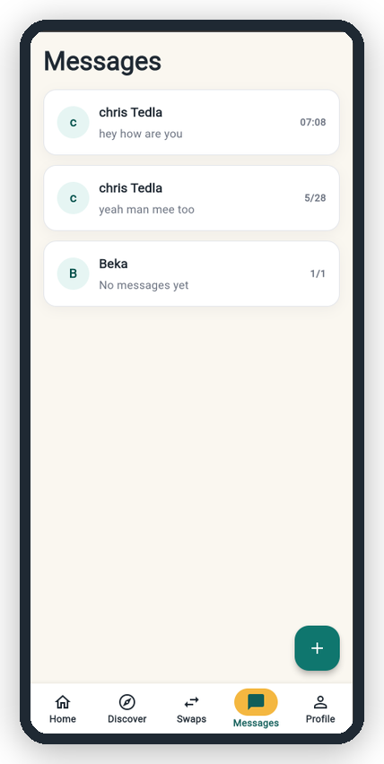
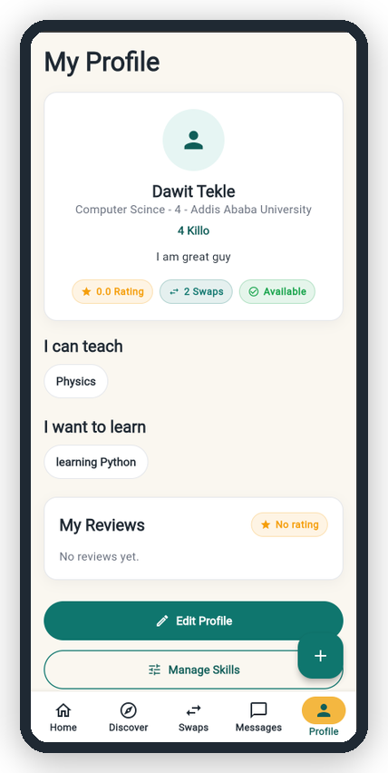
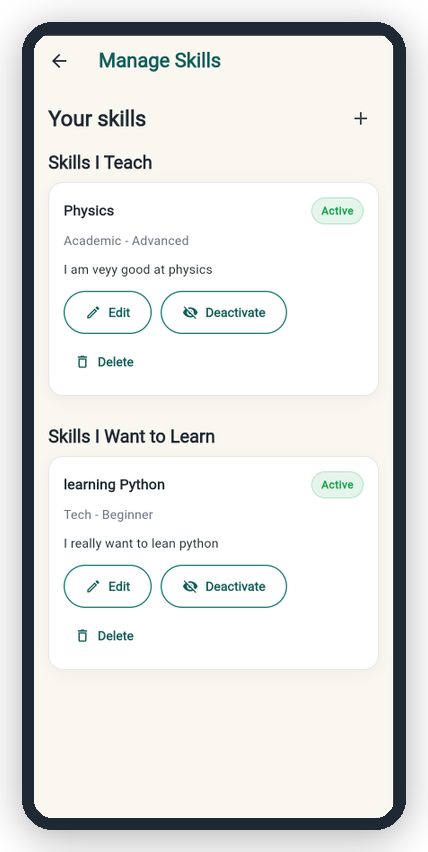
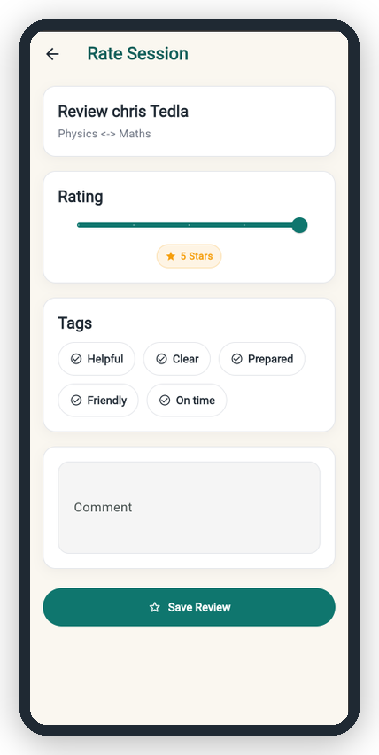

# SkillSwap

SkillSwap is a Flutter and Firebase final project for peer-to-peer student skill exchange. The app helps students exchange knowledge instead of paying money for tutoring.

For example, one student can teach Physics and wants to learn Maths. Another student can teach Maths and wants to learn Physics. SkillSwap helps them discover each other, send a swap request, chat, complete the session, and leave a review.

## Screenshots

The screenshots below are stored in `assets/readme/`.

| Login | Home | Discover |
|---|---|---|
|  |  |  |

| Request Swap | My Swaps | Messages |
|---|---|---|
|  |  |  |

| Profile | Manage Skills | Rate Session |
|---|---|---|
|  |  |  |

## Problem Statement

Many students need help learning academic, technical, creative, or language skills. Paid tutoring can be expensive, but students already have many useful skills they can share with each other.

The problem is that students usually do not know:

- Who can teach a specific skill.
- Who wants to learn the skill they can teach.
- How to request a fair skill exchange.
- How to communicate and complete a session.
- How to know if another student is reliable.

SkillSwap solves this by creating a simple system for students to exchange skills with each other.

## Main Features

- **Email/password authentication:** Students can create an account, log in, reset their password, and securely access their own data.
- **Profile setup:** New users complete their student profile with university, department, year, campus, and bio information.
- **Offered and wanted skills:** Students can add skills they can teach and skills they want to learn.
- **Discover and search:** Users can discover skills and students by searching skill names, categories, universities, or student names.
- **Match score:** The app calculates a compatibility score based on what a student wants to learn and what they can offer in return.
- **Swap requests:** Students can send skill exchange requests to other students and choose what they will offer back.
- **My Swaps tabs:** Swap requests are organized into Requests, Upcoming, and Completed sections for easy tracking.
- **Chat between students:** Students can message each other after connecting through a skill or swap request.
- **Reviews after completed swaps:** Users can leave ratings and feedback after completing a skill exchange.
- **Loading, error, and empty states:** The app shows clear loading indicators, helpful error messages, and meaningful empty screens.
- **No internet handling:** Network problems are handled with friendly messages and retry options.
- **Development demo data seeding:** Sample users and skills can be added for testing and presentation purposes.

## Technology Stack

### Frontend

- Flutter
- Dart

### Backend

- Firebase Authentication
- Cloud Firestore

### Development and Demo

- Firebase Console for checking users and collections.
- Chrome web target for presentation demo.
- No custom backend server.

## System Architecture Diagram

```text
User
  |
  v
Flutter UI
  |
  |-- Auth pages
  |-- Home
  |-- Discover
  |-- Swaps
  |-- Messages
  |-- Profile
  |
  v
Repositories and Services
  |
  |-- AuthService
  |-- UserRepository
  |-- SkillRepository
  |-- SwapRepository
  |-- ChatRepository
  |-- ReviewRepository
  |
  v
Firebase
  |
  |-- Firebase Authentication
  |-- Cloud Firestore
        |
        |-- users
        |-- skills
        |-- swapRequests
        |-- conversations
        |-- reviews
```

## Folder Structure Explanation

```text
lib/
  main.dart
  app.dart
  firebase_options.dart

  core/
    constants/
    theme/
    utils/
    widgets/

  data/
    models/
    services/
    repositories/

  demo/

  features/
    auth/
    profile_setup/
    home/
    discover/
    swaps/
    messages/
    profile/
    reviews/

  routing/
```

### Important Folders

- `core/`: shared app code such as colors, theme, validators, error handling, buttons, cards, loading screens, and reusable widgets.
- `data/models/`: Dart classes that represent Firestore data.
- `data/services/`: low-level Firebase services, such as authentication.
- `data/repositories/`: Firestore operations for each collection.
- `features/`: app screens grouped by feature.
- `routing/`: route names, route arguments, and route generation.
- `demo/`: demo seed data and mock fallback data.
  
## Firestore Collections and Important Fields

### `users`

Stores student profile information.

Important fields:

- `uid`
- `fullName`
- `email`
- `university`
- `department`
- `year`
- `bio`
- `campus`
- `photoUrl`
- `rating`
- `completedSwaps`
- `profileCompleted`
- `createdAt`

### `skills`

Stores skills students can teach or want to learn.

Important fields:

- `id`
- `ownerId`
- `ownerName`
- `ownerPhotoUrl`
- `university`
- `title`
- `category`
- `level`
- `description`
- `type`
- `exchangeFor`
- `isActive`
- `createdAt`

`type` can be:

- `offered`: a skill the user can teach.
- `wanted`: a skill the user wants to learn.

### `swapRequests`

Stores skill exchange requests between two students.

Important fields:

- `id`
- `fromUserId`
- `fromUserName`
- `toUserId`
- `toUserName`
- `offeredSkillId`
- `offeredSkillTitle`
- `wantedSkillId`
- `wantedSkillTitle`
- `message`
- `status`
- `suggestedTime`
- `mode`
- `createdAt`
- `updatedAt`

Possible statuses:

- `pending`
- `accepted`
- `declined`
- `completed`

### `conversations`

Stores chat conversation summaries.

Important fields:

- `id`
- `participants`
- `participantNames`
- `lastMessage`
- `lastMessageAt`
- `relatedRequestId`
- `lastSenderId`
- `unreadBy`

Messages are stored in:

```text
conversations/{conversationId}/messages
```

Message fields:

- `id`
- `conversationId`
- `senderId`
- `text`
- `createdAt`
- `readBy`

### `reviews`

Stores reviews after completed swap sessions.

Important fields:

- `id`
- `sessionId`
- `reviewerId`
- `revieweeId`
- `rating`
- `tags`
- `comment`
- `createdAt`

## Match Score Logic

The match score helps users find better swap partners.

A good match means:

- The other student teaches something the current user wants to learn.
- The other student wants something the current user can teach.

Scoring:

- `+50` if the other student's offered skill matches one of the current user's wanted skills.
- `+30` if the other student's `exchangeFor` matches one of the current user's offered skills.
- `+10` if the skill category matches a category from the current user's wanted skills.
- `+5` if both students are from the same university or campus.
- `+5` if the other student's rating is 4.5 or above.
- Maximum score is `100`.

Labels:

- `85-100`: Great Match
- `65-84`: Good Match
- `40-64`: Possible Match
- `1-39`: Low Match
- `0`: Not a Match

This makes Discover more useful because it is based on real skill compatibility, not random ordering.

## Important Design and Product Decisions

### One Chat Per Pair of Users

The app creates one conversation for each pair of users. The conversation id is made by sorting the two user ids.

Example:

```text
smallerUid_largerUid
```

This prevents duplicate chats between the same two students.

### Duplicate Swap Request Prevention

The app checks if there is already an active request between the same users for the same selected skill.

If a request is already `pending` or `accepted`, the app does not create another one.

Message shown:

```text
You already have an active request with this student.
```

### Match Score Based on Real Compatibility

The app does not give a high score just because a skill exists. It gives a high score when the other student teaches what the user wants and wants something the user can offer.

### Friendly Firebase Error Messages

Firebase errors are converted into simple messages that users can understand.

Example:

- Wrong password -> friendly login error.
- No internet -> retry message.
- Permission problem -> clear access message.

### SkillSwap Loading Screen

The app shows a branded SkillSwap loading screen instead of a blank white screen during startup.

### Ethiopian-Inspired Green and Gold Palette

The app uses green and gold as the main design direction.

- Green represents learning, growth, and community.
- Gold gives a warm Ethiopian-inspired accent.
- The design avoids using red-yellow-green everywhere so it stays modern and clean.

## Security Measures

Security is handled mainly through Firebase Authentication and Firestore rules.

Important security ideas:

- Users must be signed in to access app data.
- Each user has a Firebase `uid`.
- User profile documents are connected to the user's `uid`.
- Users should only edit their own profile.
- Users should only create, update, or delete their own skills.
- Swap requests should only be visible to the two users involved.
- Conversations should only be visible to participants.
- Messages should only be read or written inside conversations where the user is a participant.
- Reviews should be created by the signed-in reviewer.

No real passwords or private Firebase keys should be written in this repository.

## Error and No Internet Handling

The app includes user-friendly states for:

- Startup loading.
- Auth checking.
- Profile loading.
- Firestore loading.
- Empty lists.
- Firebase errors.
- No internet errors.

Examples:

- If the app is starting, it shows the SkillSwap loading screen.
- If there are no skills, the user sees an empty state.
- If there is no internet, the user sees a clear retry message.
- If login fails, the user sees a friendly message instead of a technical Firebase error.

Important file:

```text
lib/core/utils/app_error_handler.dart
```

## How To Run The Project

Make sure Flutter is installed and available in your terminal.

```bash
flutter pub get
flutter analyze
flutter run -d chrome
```

If Flutter is installed locally in this workspace, use:

```bash
export PATH="$PATH:/home/dawit/tools/flutter/bin"
flutter pub get
flutter run -d chrome
```

To build for web:

```bash
flutter build web
```

## Firebase Setup Instructions

Before running the app with Firebase, make sure:

1. A Firebase project exists.
2. Firebase CLI is installed and logged in.
3. FlutterFire CLI is installed.
4. The project has been configured using:

```bash
flutterfire configure
```

5. The file below exists:

```text
lib/firebase_options.dart
```

6. Firebase Authentication is enabled.
7. Email/password sign-in is enabled.
8. Cloud Firestore database is created.
9. Firestore security rules are published.

Do not commit real passwords, private keys, or secret credentials.

## Future Improvements

Current limitations of the project include:

* Real-time notifications are not yet implemented.
* Profile image uploads are not currently supported.
* Scheduling and availability management are simplified.
* The recommendation system uses a basic compatibility score and could be enhanced with more advanced matching techniques.
* Google and social authentication providers are not yet available.

These limitations have been identified as potential areas for future development.

Possible improvements:

- Push notifications.
- Google sign-in.
- Profile image upload.
- Better scheduling calendar.
- Advanced search and filtering.
- Better recommendation algorithm.
- Admin dashboard.
- Report user and moderation system.
- In-app notification center.
- Scalability driven updates.
- More detailed availability settings.
- Better review analytics.


## Contributing

Contributions are welcome and help improve the SkillSwap platform.

To contribute:

1. Fork the repository.
2. Create a new feature branch.
3. Make your changes and test them locally.
4. Commit your changes with a clear commit message.
5. Push the branch to your fork.
6. Open a Pull Request describing the changes made.

Please follow the existing project structure and coding conventions when adding new features or fixing bugs.


## Testing

Before submitting changes, run the following checks:

```bash
flutter analyze
flutter test
```

These commands help identify code quality issues and verify that existing functionality continues to work correctly.

Developers are encouraged to add unit tests and widget tests when introducing new features.


## Project Status

SkillSwap is a working final project demo. It includes a Flutter frontend, Firebase Authentication, Cloud Firestore data, and a complete student skill exchange flow.
